## 6. Interface do sistema

Esta seção apresenta as principais telas do sistema a partir do fluxo de navegação dos perfis que utilizam a plataforma. A interface foi organizada para atender quatro responsabilidades centrais do negócio: gestão da frota, gestão de pessoas, gestão de manutenção e gestão de reservas.

De forma geral, o usuário acessa um painel inicial conforme seu perfil e, a partir dele, executa as ações do seu processo. O gestor de frota possui visão mais analítica e operacional; o motorista tem uma navegação simplificada para registrar ocorrências e acompanhar viagens; o solicitante realiza reservas e acompanha aprovações; e o setor administrativo mantém os cadastros e permissões de acesso.

## 6.1. Tela principal do sistema

A tela principal varia conforme o perfil autenticado, mas mantém o mesmo objetivo: concentrar atalhos para as atividades mais frequentes, exibir indicadores resumidos e destacar pendências que exigem ação imediata. Para o gestor, a página inicial reúne indicadores da frota, alertas e acesso rápido aos módulos de veículos, manutenção e reservas.

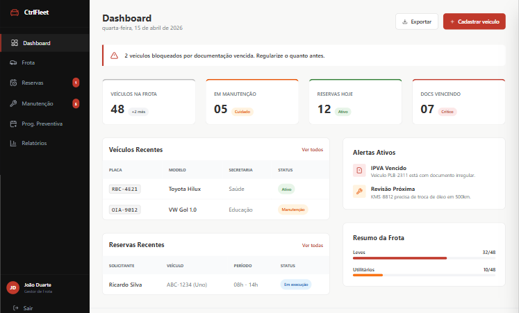

Para o motorista, o painel inicial prioriza simplicidade, com acesso às viagens registradas e à abertura de solicitações de manutenção.

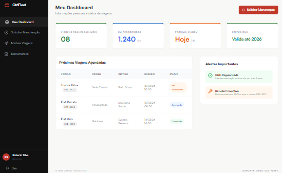

Para o solicitante, a interface inicial destaca as reservas em andamento e o atalho para abertura de uma nova solicitação.

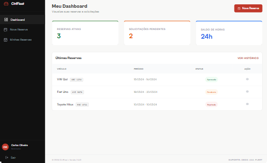

## 6.2. Telas do processo 1 - Gestão de frotas

O processo de gestão de frotas é conduzido principalmente pelo gestor. A navegação começa no painel gerencial da frota, onde ele acompanha disponibilidade, situação dos veículos e acessa rapidamente o cadastro e a atualização dos registros.

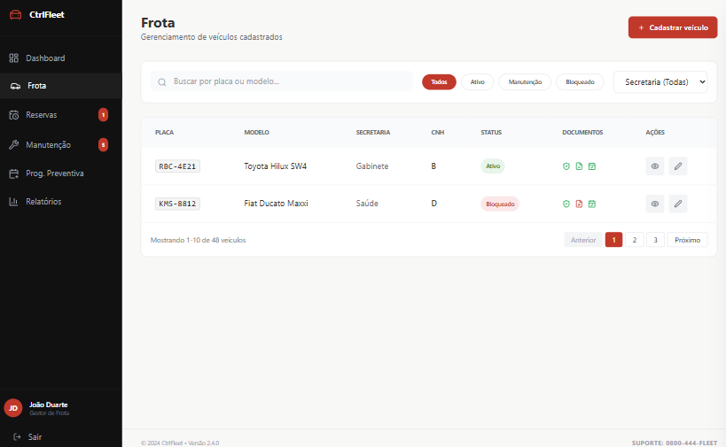

No cadastro de veículos, o gestor informa dados como placa, modelo, ano, categoria e secretaria responsável. Essa tela representa a etapa inicial do processo descrito em [processo-1-gestao-de-frotas.md](processo-1-gestao-de-frotas.md), permitindo registrar um novo veículo na base.

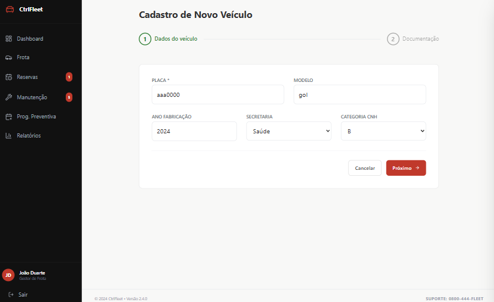

Em seguida, o fluxo avança para a complementação dos dados cadastrais e documentais, consolidando as informações necessárias para controle de regularidade e disponibilidade da frota.

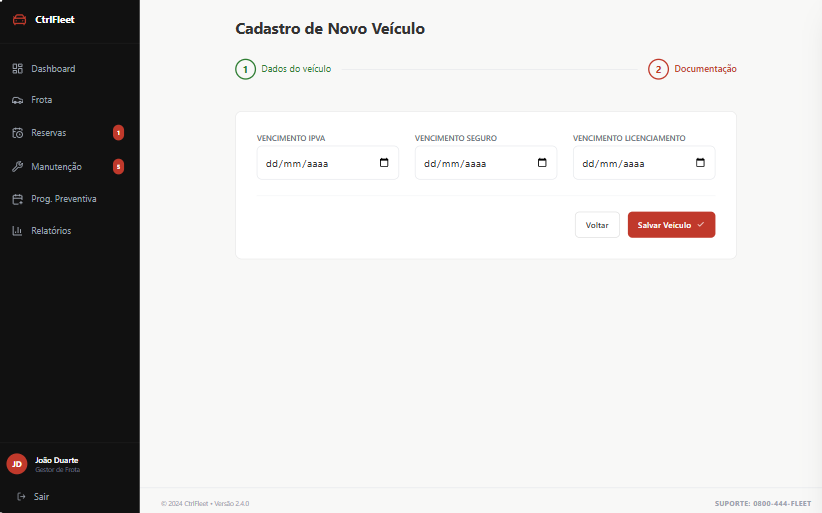

A consulta detalhada do veículo permite acompanhar documentos, status e histórico de movimentações. Essa visão apoia atividades como atualização documental, controle de status e análise do histórico do bem.

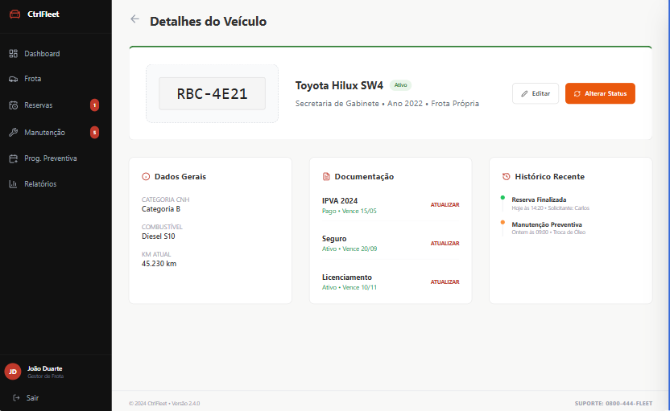

## 6.3. Telas do processo 2 - Gestão de pessoas

O processo de gestão de pessoas é executado pelo setor administrativo, responsável por cadastrar usuários, editar permissões e manter a base de perfis atualizada. O painel administrativo funciona como ponto de entrada para o gerenciamento dos cadastros.

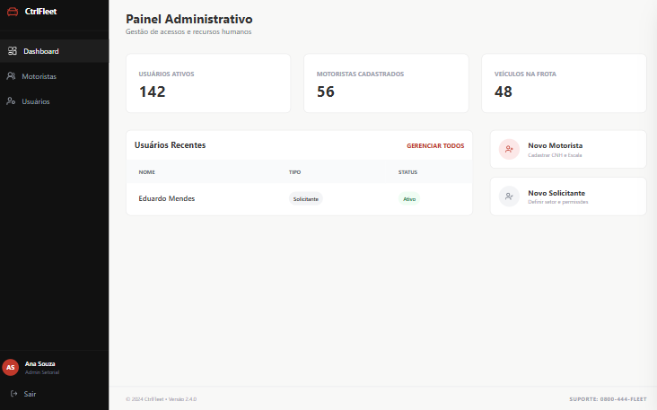

A listagem de usuários apresenta os perfis cadastrados, facilita consultas rápidas e permite iniciar ações de edição ou criação. Essa tela apoia o controle contínuo de motoristas e usuários solicitantes.

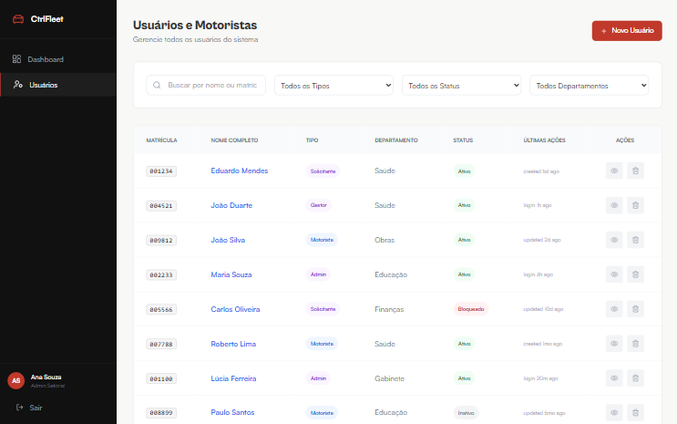

Ao cadastrar um novo usuário, o administrador informa os dados básicos necessários para habilitar o acesso ao sistema e vincular o perfil à sua responsabilidade dentro do fluxo operacional.

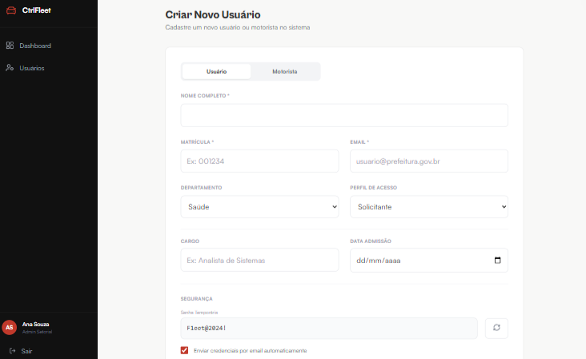

Na edição de usuário, são ajustadas informações cadastrais e permissões, etapa coerente com a manutenção de habilitações, vínculos e acessos prevista no processo.

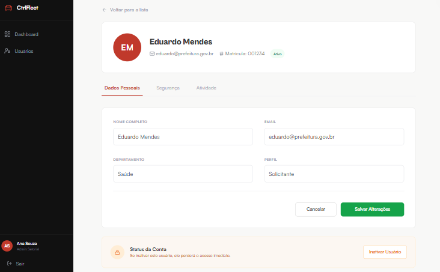

## 6.4. Telas do processo 3 - Gestão de manutenção

Na gestão de manutenção, o fluxo envolve dois perfis. O motorista registra a solicitação quando identifica uma falha ou necessidade preventiva, informando veículo, descrição do problema e evidências.

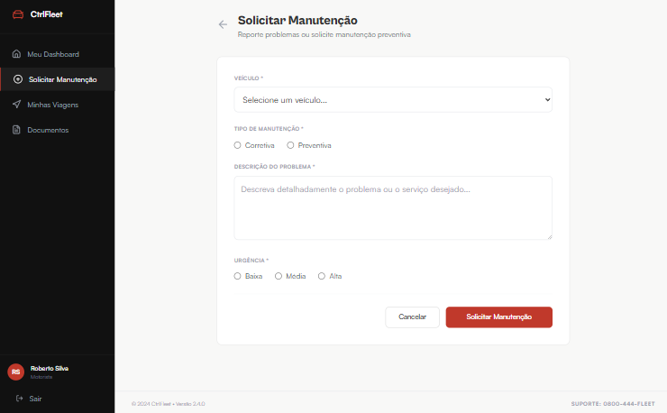

Após o envio, o gestor de frota analisa a ocorrência, define prioridade e conduz a autorização da manutenção. Essa tela representa a etapa decisória do processo, em que a solicitação pode ser aprovada ou reprovada.

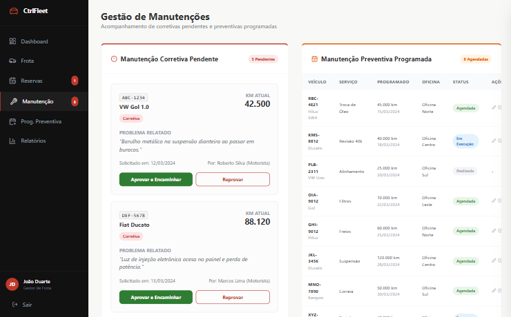

Quando a manutenção é preventiva ou já está autorizada, o gestor acompanha a programação e o histórico de intervenções, garantindo o controle sobre prazos, custos e disponibilidade dos veículos.

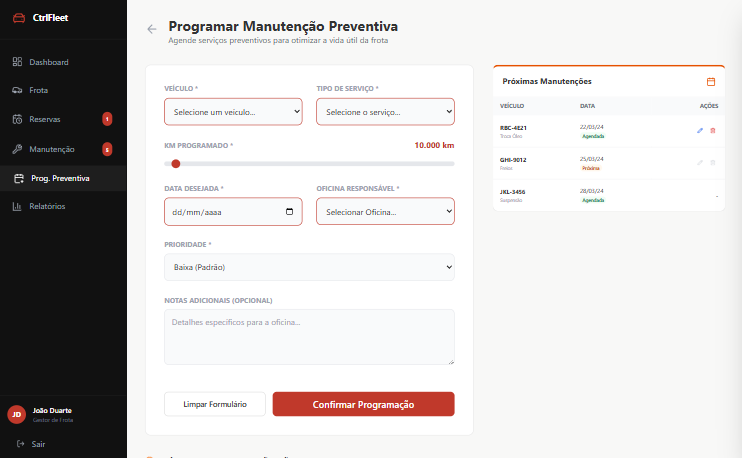

## 6.5. Telas do processo 4 - Gestão de reservas

O processo de reserva começa com o solicitante, que informa período, destino, justificativa e seleciona os recursos disponíveis para a viagem. A tela foi pensada para tornar esse preenchimento rápido e objetivo.

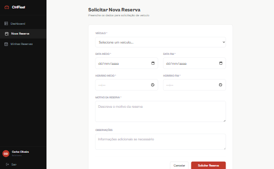

Após preencher os dados principais, o usuário revisa a reserva e confirma a solicitação, concluindo a etapa de envio para análise do gestor.

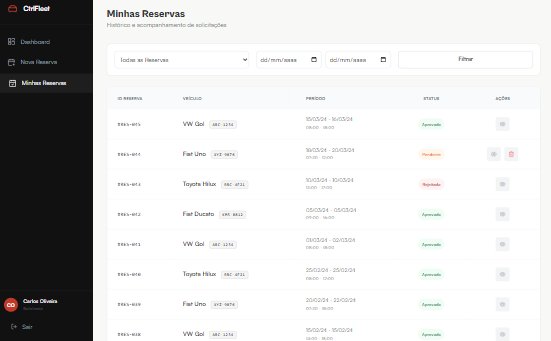

Em seguida, o gestor de frota avalia a solicitação recebida, verificando os dados do deslocamento e registrando a decisão de aprovação ou reprovação com parecer.

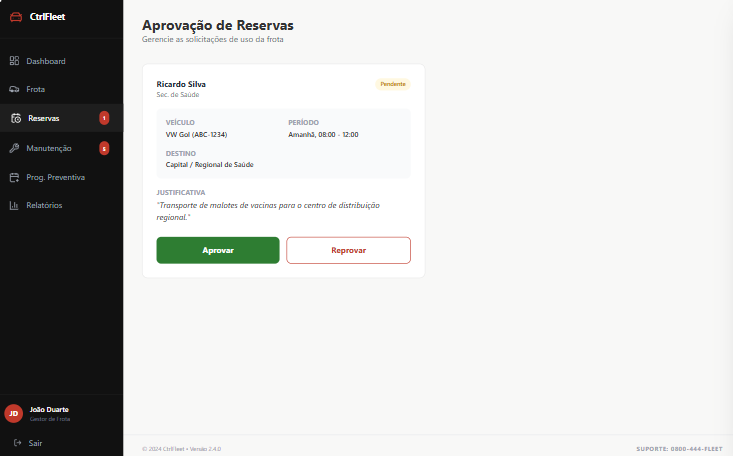

## 6.6. Telas complementares de acompanhamento

Além dos processos principais, algumas telas reforçam a operação diária do sistema. A visão de viagens do motorista permite acompanhar os deslocamentos sob sua responsabilidade e consultar o andamento das atividades já registradas.

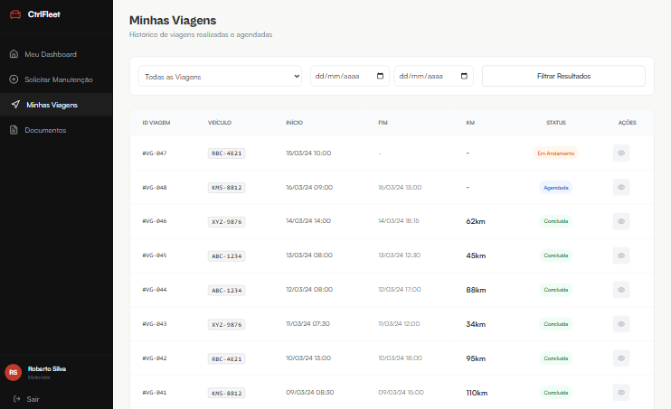

Essas interfaces complementares fortalecem a rastreabilidade do uso da frota e oferecem ao usuário uma navegação orientada por tarefas, em vez de apenas menus técnicos do sistema.
