## 6. Interface do sistema

Esta seção documenta as telas do **CtrlFleet** a partir dos protótipos implementados no front-end React. A interface foi organizada em quatro áreas de negócio — gestão de frotas, gestão de pessoas, gestão de manutenção e gestão de reservas — e adaptada a quatro perfis de acesso: **Administrador**, **Gestor de Frota**, **Motorista** e **Solicitante**.

O padrão visual mantém barra lateral escura com navegação por perfil, cabeçalho com título e subtítulo, cartões de indicadores (KPIs) e listagens em cards. As capturas de tela estão em `docs/images/telas/`.

---

## 6.1. Telas públicas e autenticação

### 6.1.1. Página institucional (landing page)

| Item | Descrição |
| --- | --- |
| **Rota** | `/` ou `/home` |
| **Perfil** | Público (sem login) |
| **Objetivo** | Apresentar o valor do sistema e direcionar o usuário ao login |

Página de entrada institucional voltada ao setor público. Apresenta o posicionamento do CtrlFleet, destaques de reservas com aprovação, checklists vinculados à quilometragem e auditoria de decisões. O menu superior leva às seções Sobre, Indicadores, Como funciona, Módulos, Perfis e Equipe. O botão **Acessar sistema** encaminha para a tela de login.

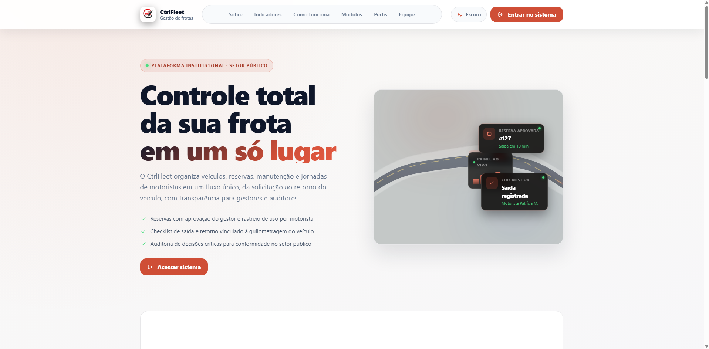

---

### 6.1.2. Login

| Item | Descrição |
| --- | --- |
| **Rota** | `/login` |
| **Perfil** | Público |
| **Objetivo** | Autenticar o usuário e redirecionar ao painel do seu perfil |

Tela dividida em painel ilustrativo (métricas de frota, reservas e checklists) e formulário de acesso. Campos: e-mail institucional e senha, com opção *Manter conectado* e link *Esqueci minha senha*. Após autenticação, o sistema direciona automaticamente para a área do perfil (admin, gestor, motorista ou solicitante). Em ambiente de desenvolvimento, a seção *Acesso rápido* lista contas de demonstração por perfil.

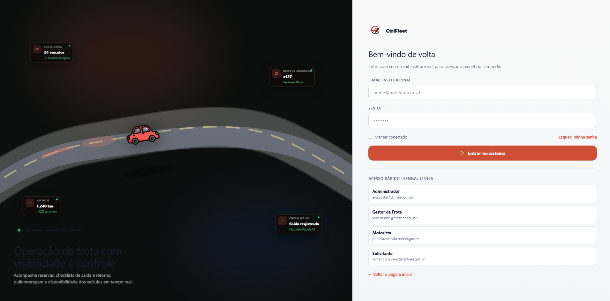

---

## 6.2. Painéis principais por perfil

### 6.2.1. Dashboard do gestor de frota

| Item | Descrição |
| --- | --- |
| **Rota** | `/gestor/dashboard` |
| **Perfil** | Gestor de Frota |
| **Objetivo** | Visão operacional centralizada da frota e das reservas |

Painel inicial do gestor com banner de boas-vindas, contadores de veículos disponíveis, bloqueados, em manutenção e reservas pendentes. Exibe a **saúde da frota** (distribuição por status), **reservas pendentes**, **viagens em andamento**, **ações rápidas** (atalhos para frota, reservas e manutenção), **alertas documentais** e **atividade recente**. Botão principal: **+ Cadastrar veículo**.

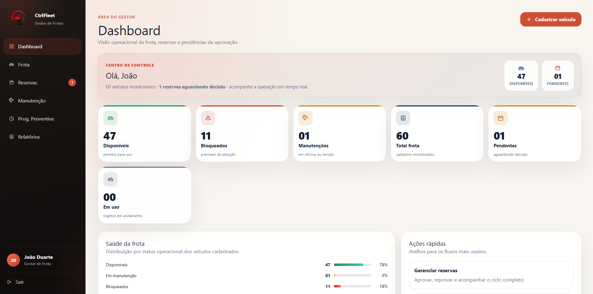

---

### 6.2.2. Dashboard do administrador

| Item | Descrição |
| --- | --- |
| **Rota** | `/admin/dashboard` |
| **Perfil** | Administrador |
| **Objetivo** | Governança de contas, permissões e auditoria |

Painel administrativo com status do sistema, sincronização automática e métricas de usuários, pendências, perfis ativos e eventos de auditoria do dia. A seção **Aprovações pendentes** permite aprovar ou reprovar cadastros aguardando validação. O gráfico **Status das contas** distribui usuários entre ativos, pendentes, bloqueados e inativos. Atalho para **+ Novo usuário**.

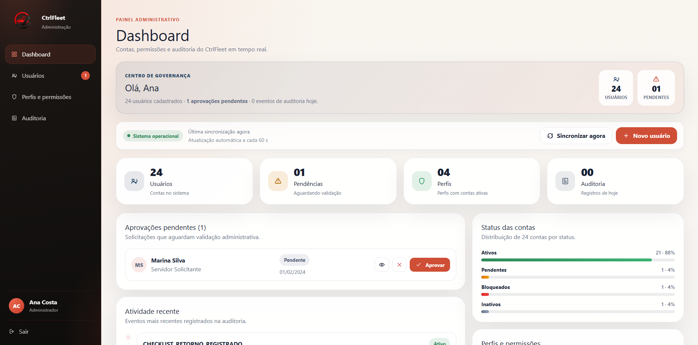

---

### 6.2.3. Dashboard do solicitante

| Item | Descrição |
| --- | --- |
| **Rota** | `/solicitante/dashboard` |
| **Perfil** | Solicitante |
| **Objetivo** | Resumo das solicitações de reserva do usuário logado |

Painel com saudação, matrícula do solicitante e cartões de total, pendentes, aprovadas e em uso. Blocos de **próximas viagens**, **ações rápidas** (nova reserva, minhas reservas, pendentes de análise), **atividade recente** e **pendências**. Botão principal: **+ Nova reserva**.

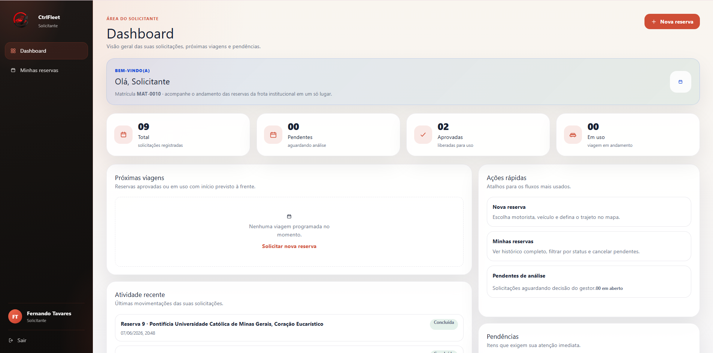

---

### 6.2.4. Minhas viagens (motorista)

| Item | Descrição |
| --- | --- |
| **Rota** | `/motorista/:motoristaId` |
| **Perfil** | Motorista |
| **Objetivo** | Listar reservas aprovadas, viagens em andamento e histórico |

Tela principal do motorista com busca por viagem, destino, placa ou solicitante, filtros de período e ordenação. Cada card exibe rota (origem/destino), veículo, solicitante, horários previstos e quilometragem (inicial, checklist e final). Viagens aprovadas exibem aviso de liberação do checklist; viagens concluídas mostram KM percorrida calculada.

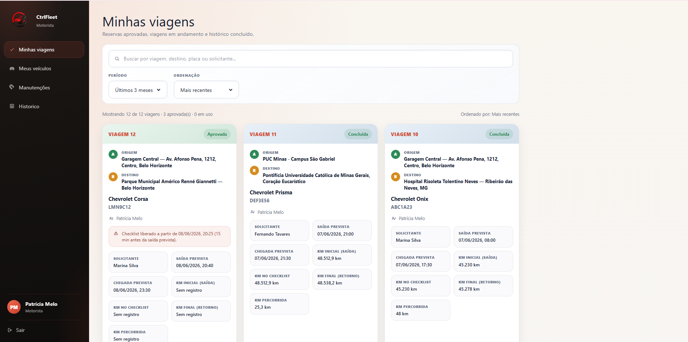

---

## 6.3. Telas do processo 1 — Gestão de frotas

Processo conduzido pelo **Gestor de Frota**, conforme [processo-1-gestao-de-frotas.md](processo-1-gestao-de-frotas.md).

### 6.3.1. Listagem da frota

| Item | Descrição |
| --- | --- |
| **Rota** | `/gestor/frota` |
| **Objetivo** | Consultar, filtrar e acessar o cadastro de cada veículo |

Exibe KPIs (total, ativos, manutenção, inativos, bloqueados), busca por placa/modelo/tipo e filtros por status e tipo de veículo. Os veículos aparecem em cards com placa, modelo, ano, categoria CNH e status. Ações: **Mapa da frota** e **+ Cadastrar veículo**.

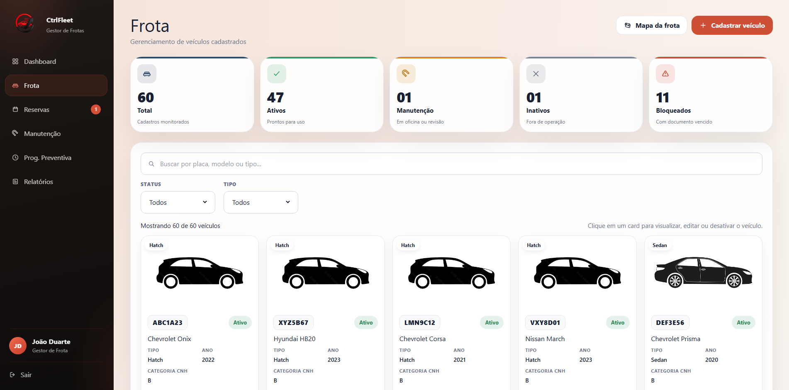

---

### 6.3.2. Cadastro de novo veículo

| Item | Descrição |
| --- | --- |
| **Rota** | `/gestor/frota/novo` |
| **Objetivo** | Registrar veículo, documentação obrigatória e motorista vinculado |

Formulário unificado com dados do veículo (placa, marca, modelo, secretaria, ano, status, tipo e categoria CNH), vínculo com motorista responsável e documentação (IPVA, seguro, licenciamento). Painel lateral de **pré-visualização** atualiza em tempo real o resumo do cadastro.

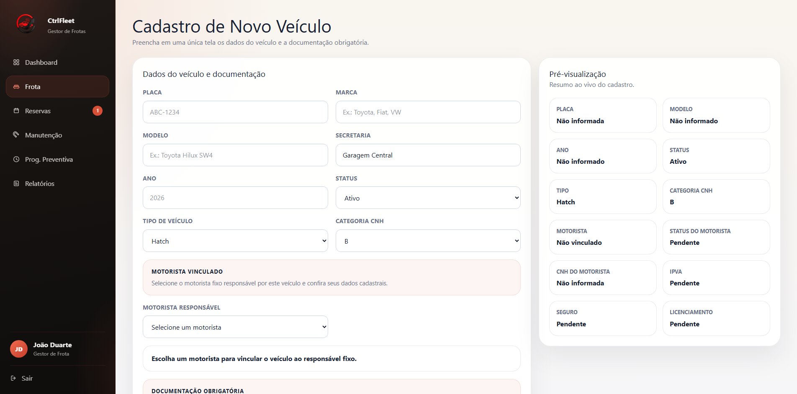

---

### 6.3.3. Visualização do veículo

| Item | Descrição |
| --- | --- |
| **Rota** | `/gestor/frota/:vehicleId` |
| **Objetivo** | Consultar ficha completa, documentação e quilometragem |

Ficha detalhada com status, placa, modelo, ano, CNH mínima, quilometragem atual, secretaria e motorista responsável. Atalhos para **Histórico do veículo** e **Timeline de reserva**. Seção **Documentação** com validade e situação de pagamento de IPVA, licenciamento e seguro. Botão **Editar cadastro**.

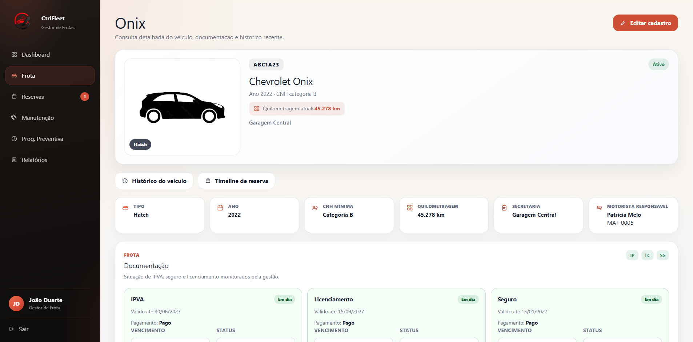

---

### 6.3.4. Edição do veículo

| Item | Descrição |
| --- | --- |
| **Rota** | `/gestor/frota/:vehicleId/editar` |
| **Objetivo** | Atualizar dados cadastrais e documentação |

Mesma estrutura do cadastro, pré-preenchida com os dados do veículo selecionado. Permite alterar status, motorista vinculado e datas de vencimento dos documentos, com pré-visualização ao vivo.

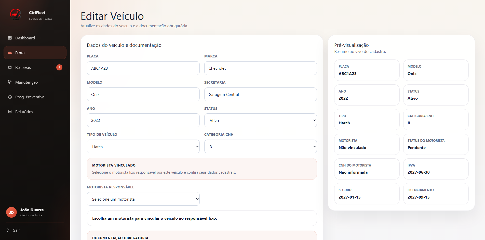

---

### 6.3.5. Mapa da frota

| Item | Descrição |
| --- | --- |
| **Rota** | Modal a partir de `/gestor/frota` |
| **Objetivo** | Visualizar geolocalização dos veículos e garagem central |

Mapa interativo (OpenStreetMap) com marcadores dos veículos. Painel lateral lista unidades na garagem com busca e filtros por status e tipo. Ao selecionar um veículo, exibe placa, status e coordenadas.

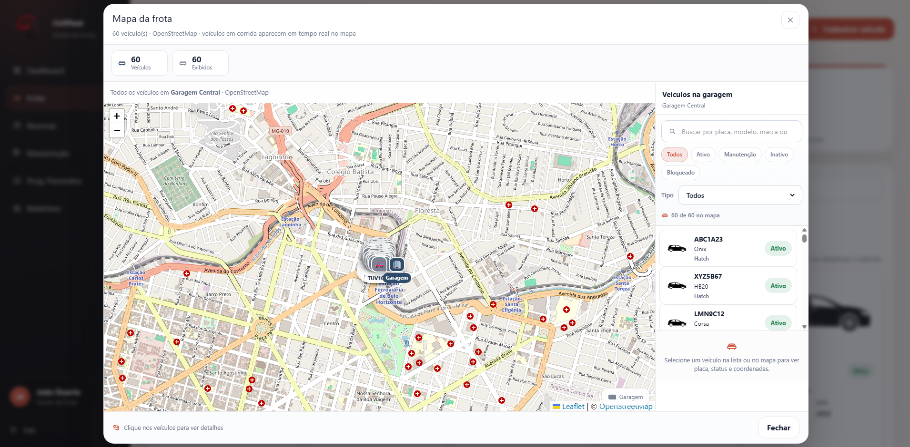

---

## 6.4. Telas do processo 2 — Gestão de pessoas

Processo conduzido pelo **Administrador**, conforme [processo-2-gestao-de-pessoas.md](processo-2-gestao-de-pessoas.md).

### 6.4.1. Listagem de usuários

| Item | Descrição |
| --- | --- |
| **Rota** | `/admin/usuarios` |
| **Objetivo** | Consultar, filtrar e gerenciar contas do sistema |

Tabela com nome, e-mail, matrícula, perfil e status (ativo, pendente, bloqueado, inativo). Filtros por nome, matrícula, status e perfil. Ações por linha: editar, alterar permissões, bloquear/desbloquear, aprovar pendências e reenviar convite. Botão **+ Novo usuário**.

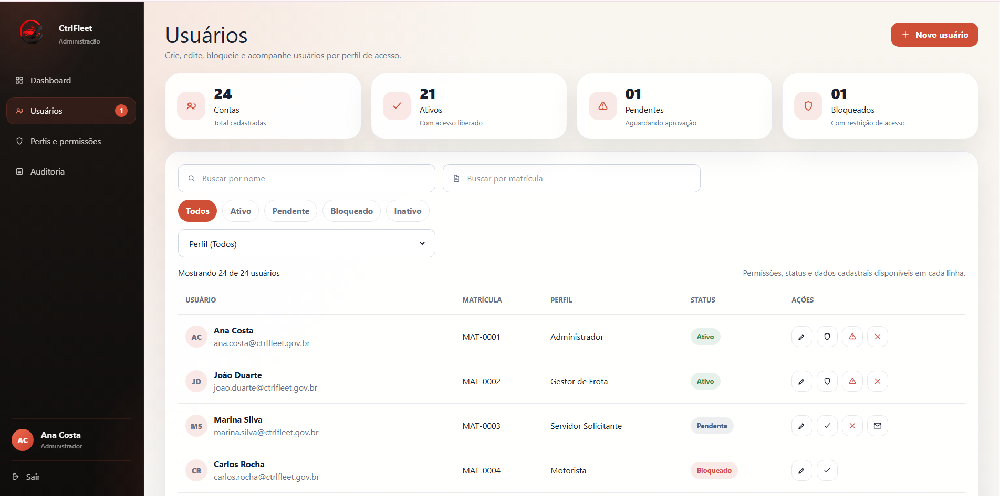

---

### 6.4.2. Criação de usuário

| Item | Descrição |
| --- | --- |
| **Rota** | `/admin/usuarios/novo` |
| **Objetivo** | Cadastrar nova conta com perfil e credenciais |

Formulário com nome, matrícula, e-mail, perfil de acesso, data de admissão e senha temporária gerada automaticamente. Para motoristas, inclui campos de CNH e validade. Opção **Enviar credenciais por e-mail automaticamente** integrada ao serviço de notificações do sistema.

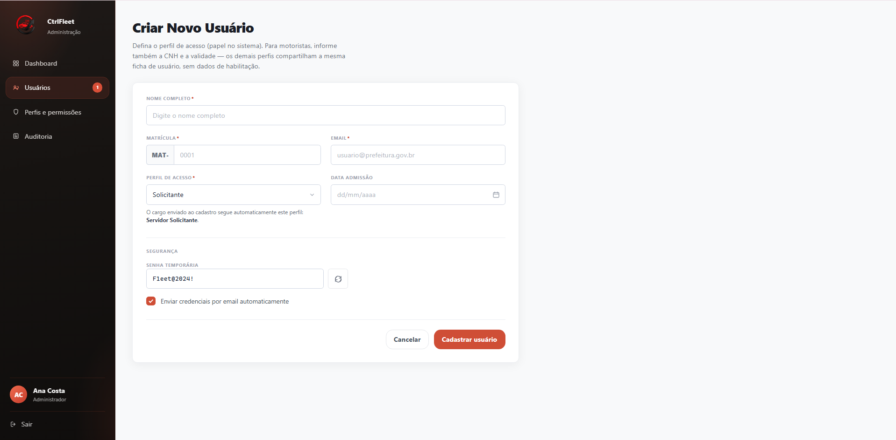

---

### 6.4.3. Perfis e permissões

| Item | Descrição |
| --- | --- |
| **Rota** | `/admin/perfis` |
| **Objetivo** | Visualizar a matriz de acesso por tipo de usuário |

Resumo de perfis ativos, módulos protegidos, usuários vinculados e revisões do mês. Cards dos perfis **Administrador**, **Gestor de Frota**, **Motorista** e **Servidor Solicitante**, com descrição funcional, módulos liberados e quantidade de usuários.

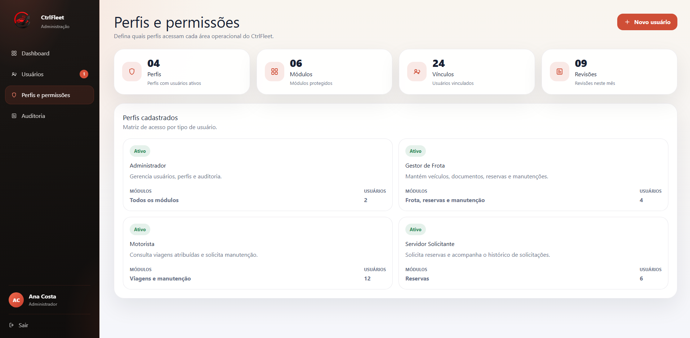

---

### 6.4.4. Auditoria

| Item | Descrição |
| --- | --- |
| **Rota** | `/admin/auditoria` |
| **Objetivo** | Rastrear ações críticas do sistema |

Log cronológico de eventos administrativos e operacionais: aprovações de reserva, registro de checklists, início e fim de trajetos, alterações de usuários e acessos. Cada registro traz data/hora, código da ação, status e detalhe descritivo.

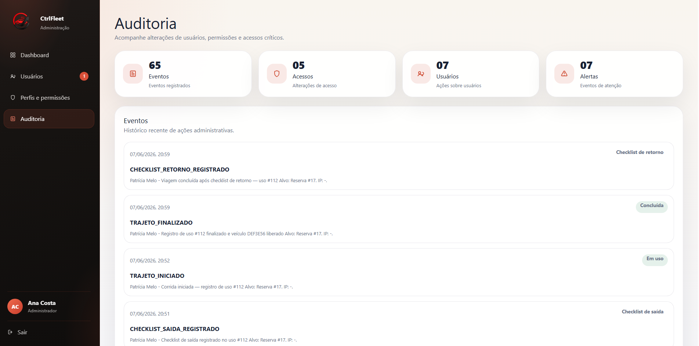

---

## 6.5. Telas do processo 3 — Gestão de manutenção

Processo envolvendo **Motorista** (solicitação) e **Gestor de Frota** (triagem e programação), conforme [processo-3-gestao-de-manutencao.md](processo-3-gestao-de-manutencao.md).

### 6.5.1. Triagem de manutenção (gestor)

| Item | Descrição |
| --- | --- |
| **Rota** | `/gestor/manutencao` |
| **Objetivo** | Analisar, aprovar ou reprovar solicitações corretivas e preventivas |

Painel com contadores de pendentes, agendadas, em andamento e histórico. Filtros por status, prioridade, tipo e veículo. Cards de solicitação exibem tipo (corretiva/emergência), placa, descrição do problema, motorista, quilometragem e prioridade. Ações: **Aprovar** e **Reprovar**, com atalhos para prontuário e ficha do veículo.

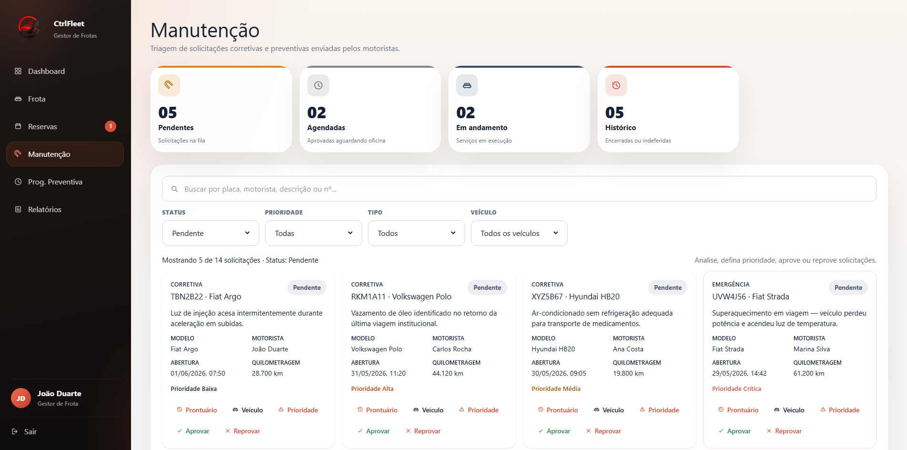

---

### 6.5.2. Programação preventiva (gestor)

| Item | Descrição |
| --- | --- |
| **Rota** | `/gestor/programacao-preventiva` |
| **Objetivo** | Acompanhar revisões por data e quilometragem |

Dashboard preventivo com KPIs de preventivas próximas, atrasadas, agendadas, veículos parados, serviços em andamento e alertas. Lista de programação com datas-alvo, quilometragem atual e indicadores de proximidade (janela de 45 dias / 2.000 km). Seção de veículos indisponíveis para reserva por estar em revisão. Atalho para **Triagem corretiva**.

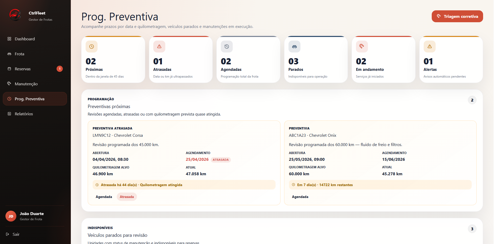

---

## 6.6. Telas do processo 4 — Gestão de reservas

Processo envolvendo **Solicitante** (pedido) e **Gestor de Frota** (decisão), conforme [processo-4-gestao-de-reserva.md](processo-4-gestao-de-reserva.md).

### 6.6.1. Nova reserva (solicitante)

| Item | Descrição |
| --- | --- |
| **Rota** | `/solicitante/reservas/nova` |
| **Objetivo** | Solicitar uso de veículo com trajeto georreferenciado |

Formulário em etapas: seleção de motorista e veículo vinculado, período (início e fim), justificativa, origem e destino. Mapa interativo (Belo Horizonte) com busca de endereço e marcação dos pontos A e B. Botão **Solicitar Reserva** envia a demanda ao gestor e dispara notificação por e-mail.

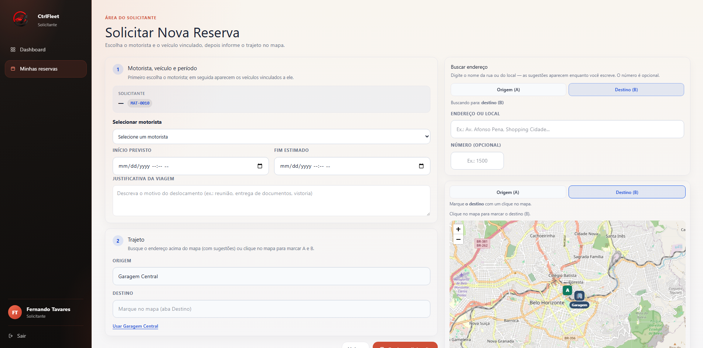

---

### 6.6.2. Minhas reservas (solicitante)

| Item | Descrição |
| --- | --- |
| **Rota** | `/solicitante/reservas` |
| **Objetivo** | Acompanhar status e trajeto das solicitações |

Listagem em cards com mapa da rota, status (pendente, aprovada, em uso, concluída, cancelada), veículo, origem, destino e horários previstos. Filtros por status e resumo numérico no topo. Reservas canceladas permitem **Excluir do histórico**.

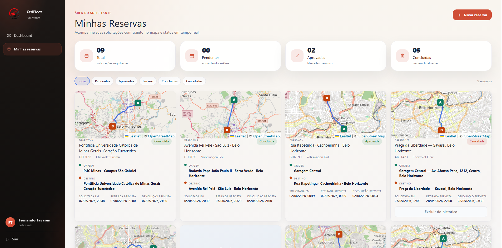

---

### 6.6.3. Gestão de reservas (gestor)

| Item | Descrição |
| --- | --- |
| **Rota** | `/gestor/reservas` |
| **Objetivo** | Aprovar, reprovar e monitorar o ciclo das reservas |

Painel com totais por status (pendentes, aprovadas, em uso, concluídas). Busca por destino, placa, solicitante ou número. Cards exibem rota, veículo, solicitante, motorista designado e datas. Ações de aprovação/reprovação diretamente no card.

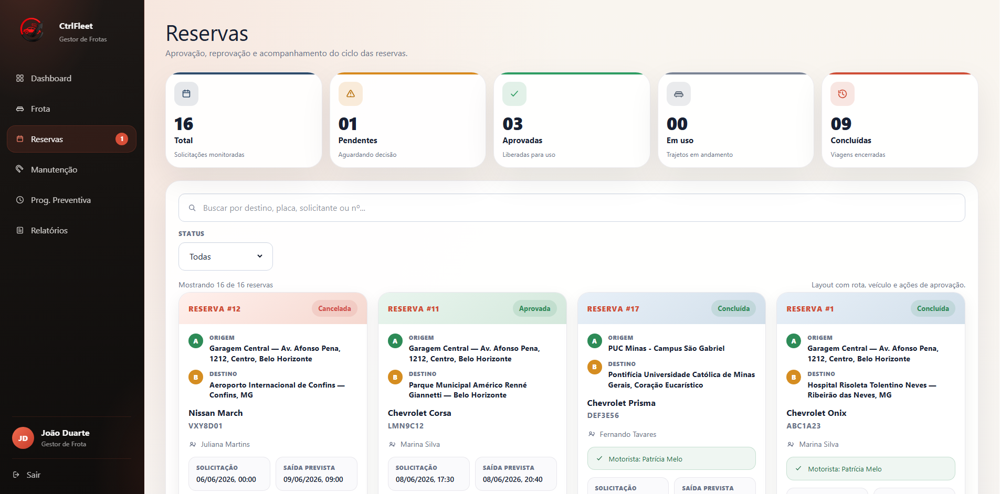

---

### 6.6.4. Timeline de uso da reserva (gestor)

| Item | Descrição |
| --- | --- |
| **Rota** | `/gestor/reservas/:reservaId/historico` |
| **Objetivo** | Rastrear encerramento de uso após retorno do veículo |

Visão pós-viagem com resumo da reserva concluída, motorista, período, quilometragem percorrida e detalhes do registro de uso (saída, retorno e hodômetro inicial/final). Alimenta a rastreabilidade entre reserva aprovada e jornada do motorista.

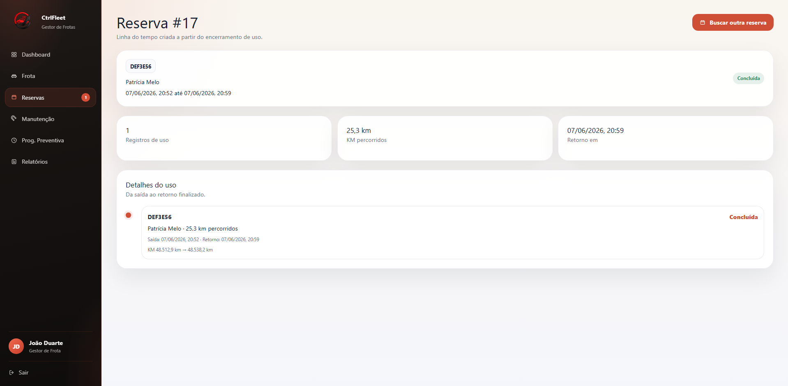

---

## 6.7. Jornada do motorista — viagem, checklist e corrida

Fluxo operacional após aprovação da reserva, vinculado ao registro de uso e à auditoria do sistema.

### 6.7.1. Detalhe da viagem

| Item | Descrição |
| --- | --- |
| **Rota** | `/motorista/:motoristaId/reservas/:reservaId` |
| **Objetivo** | Consultar dados da viagem aprovada antes do checklist |

Card com solicitante, horários previstos, origem, destino e mapa do trajeto. Exibe aviso de liberação do checklist (15 minutos antes da saída prevista) ou confirmação de checklist concluído, habilitando **Iniciar corrida**.

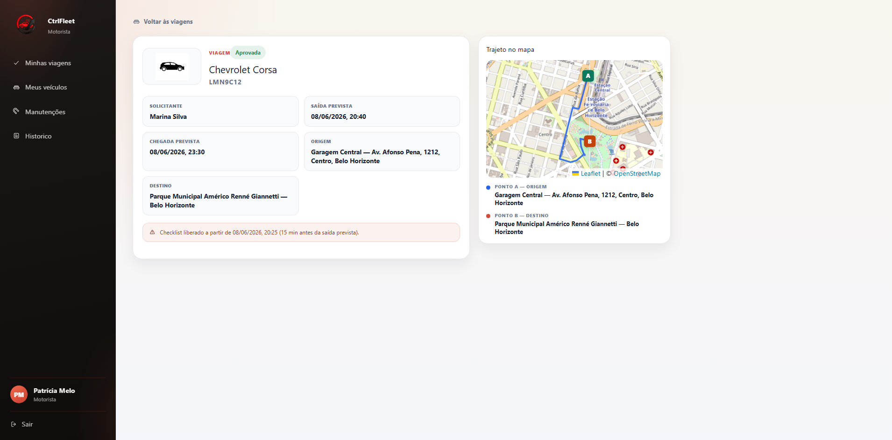

---

### 6.7.2. Checklist de saída

| Item | Descrição |
| --- | --- |
| **Rota** | `/motorista/:motoristaId/reservas/:reservaId/checklist-saida` |
| **Objetivo** | Registrar quilometragem e inspeções antes da saída |

Registro da quilometragem na saída (validada contra o hodômetro atual do veículo) e preenchimento por tipo de inspeção: Limpeza, Mecânica, Iluminação e Combustível. Cada tipo possui itens obrigatórios com contador de progresso.

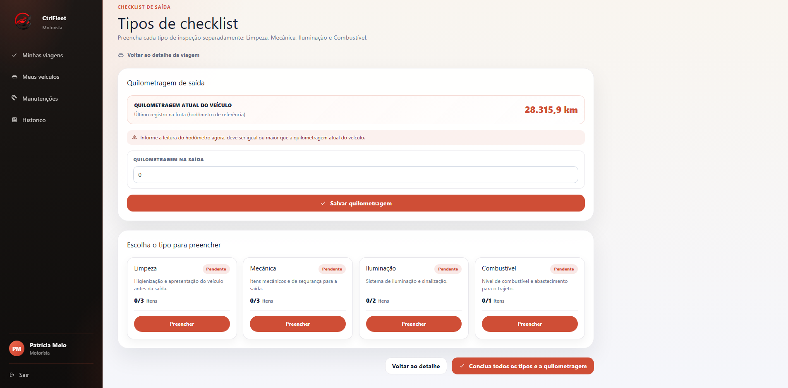

---

### 6.7.3. Iniciar corrida

| Item | Descrição |
| --- | --- |
| **Rota** | `/motorista/:motoristaId/reservas/:reservaId/iniciar-corrida` |
| **Objetivo** | Confirmar saída e marcar reserva como em uso |

Tela pós-checklist com resumo da viagem, quilometragem registrada e seleção do tempo de simulação no mapa (30 s a 5 min). Botão **Iniciar corrida agora** registra o início do trajeto na auditoria.

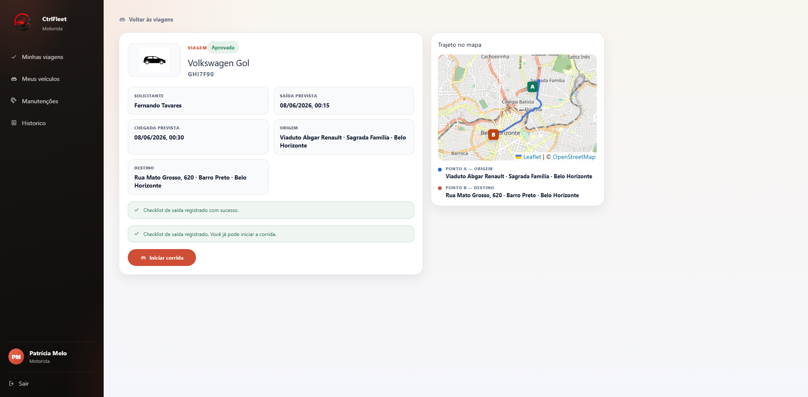

---

### 6.7.4. Corrida em andamento

| Item | Descrição |
| --- | --- |
| **Rota** | `/motorista/:motoristaId/reservas/:reservaId/corrida` |
| **Objetivo** | Acompanhar deslocamento simulado ida e volta no mapa |

Mapa em tempo real com rota entre pontos A e B, percentual de progresso, distância da ida e distância total (ida + volta). Ao finalizar, abre o resumo da corrida.

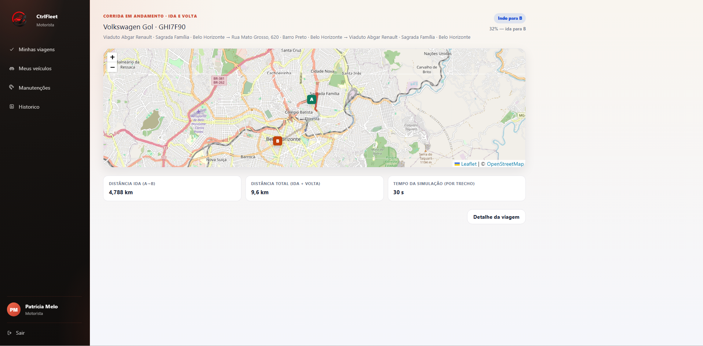

---

### 6.7.5. Resumo da corrida finalizada

| Item | Descrição |
| --- | --- |
| **Rota** | Modal ao encerrar a corrida |
| **Objetivo** | Comparar tempo estimado e real e encaminhar ao checklist de retorno |

Modal com distância percorrida (ida + volta), rota completa, veículo utilizado, tempo estimado versus tempo real da simulação e botão **Preencher checklist de retorno**.

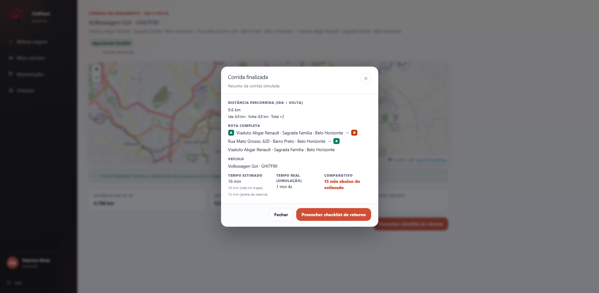

---

### 6.7.6. Checklist de retorno

| Item | Descrição |
| --- | --- |
| **Rota** | `/motorista/:motoristaId/reservas/:reservaId/checklist-retorno` |
| **Objetivo** | Registrar inspeções e quilometragem automática no retorno |

Exibe quilometragem de saída e retorno estimado (saída + KM percorridos). Tipos de inspeção: Estado do veículo e Combustível e entrega. Ao concluir todos os itens, a viagem é encerrada e o hodômetro do veículo é atualizado.

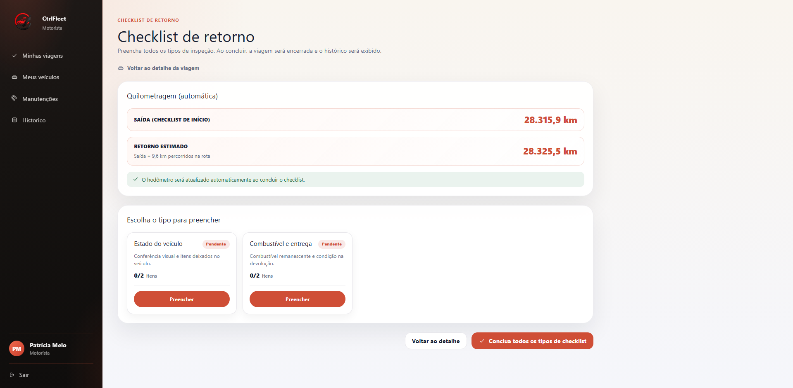

---

### 6.7.7. Histórico da viagem

| Item | Descrição |
| --- | --- |
| **Rota** | `/motorista/:motoristaId/reservas/:reservaId/historico` |
| **Objetivo** | Consultar cronologia e rota após encerramento |

Tela de encerramento com banner de sucesso, métricas de KM saída/percorrida/retorno, cronologia (saída real, duração, retorno real) comparada à janela prevista na reserva e mapa da rota percorrida.

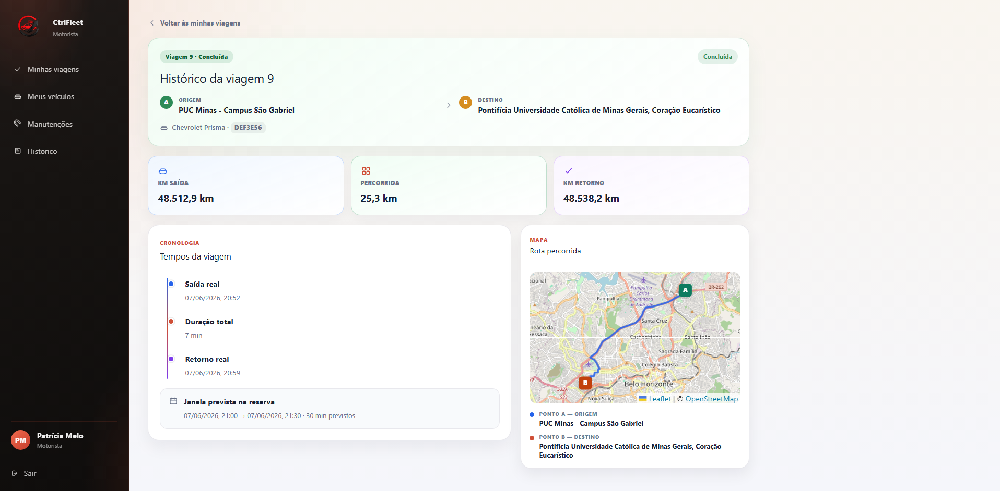

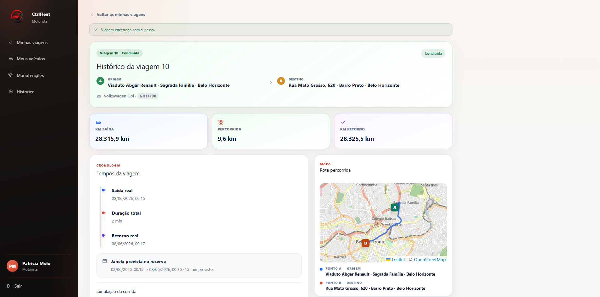

---

## 6.8. Navegação por perfil

| Perfil | Menu lateral | Módulos principais |
| --- | --- | --- |
| **Administrador** | Dashboard, Usuários, Perfis e permissões, Auditoria | Gestão de pessoas e governança |
| **Gestor de Frota** | Dashboard, Frota, Reservas, Manutenção, Prog. Preventiva, Relatórios | Frotas, reservas e manutenção |
| **Motorista** | Minhas viagens, Meus veículos, Manutenções, Histórico | Jornada, checklists e solicitações |
| **Solicitante** | Dashboard, Minhas reservas | Solicitação e acompanhamento de reservas |

---

## 6.9. Padrões de interface

- **Responsividade:** layout adaptável com sidebar fixa em desktop; formulários e mapas ocupam área principal em grid de duas colunas quando aplicável.
- **Feedback visual:** badges de status por cor (verde = ativo/aprovado, amarelo = pendente, vermelho = bloqueado/crítico, azul = concluído).
- **Mapas:** integração com Leaflet/OpenStreetMap para reservas, frota e jornada do motorista; busca de endereços via Photon/Nominatim.
- **Notificações:** decisões de reserva, criação de conta e lembretes de viagem enviados por e-mail transacional (templates HTML do sistema).
- **Rastreabilidade:** ações de aprovação, checklist, início/fim de trajeto e encerramento de uso registradas na auditoria e refletidas nas timelines de reserva e histórico do motorista.
