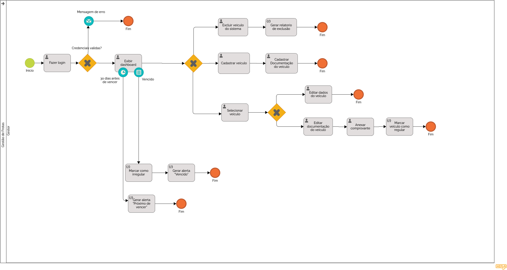

### 3.3.1 Processo 1 – NOME DO PROCESSO

O processo de gestão de frotas, especialmente no controle de veículos, documentos e histórico, ainda apresenta falhas quando feito de forma manual. Atualmente, muitas informações são controladas por planilhas separadas ou anotações, o que pode causar vencimento de documentos, uso de veículos irregulares e dificuldade para acompanhar o histórico da frota.

A melhoria está em utilizar um sistema digital que centralize todas essas informações. Nele, será possível cadastrar veículos, evitar dados duplicados e acompanhar automaticamente os prazos de documentos como IPVA, seguro e licenciamento, com alertas antes do vencimento. Caso um documento expire, o veículo pode ser bloqueado até a regularização.

Além disso, o sistema permitirá atualizar documentos de forma simples, controlar o status dos veículos (ativo, em manutenção, reservado ou inativo) e registrar todas as movimentações em um histórico completo. Também será possível registrar a baixa de veículos, mantendo todas as informações salvas. Assim, o processo se torna mais organizado, seguro e eficiente, reduzindo erros e retrabalho.

#### Detalhamento das atividades

**Cadastrar Veículo**

| **Campo**              | **Tipo**       | **Restrições**                              | **Valor default** |
| ---------------------- | -------------- | ------------------------------------------- | ----------------- |
| Placa                  | Caixa de Texto | Única; obrigatório                          | —                 |
| Modelo                 | Caixa de Texto | Obrigatório                                 | —                 |
| Ano                    | Numérico       | Obrigatório                                 | —                 |
| Secretaria responsável | Seleção única  | Obrigatório                                 | —                 |
| Status                 | Seleção única  | Ativo / Em manutenção / Reservado / Inativo | Ativo             |
| Categoria CNH          | Seleção única  | Obrigatório                                 | —                 |

| **Comandos**   | **Destino**            | **Tipo** |
| -------------- | ---------------------- | -------- |
| Salvar veículo | Registro de Documentos | default  |
| Cancelar       | Início do Processo     | cancel   |

**Registrar Documentos**

| **Campo**     | **Tipo** | **Restrições** | **Valor default** |
| ------------- | -------- | -------------- | ----------------- |
| IPVA          | Data     | Obrigatório    | —                 |
| Seguro        | Data     | Obrigatório    | —                 |
| Licenciamento | Data     | Obrigatório    | —                 |

| **Comandos**      | **Destino**                 | **Tipo** |
| ----------------- | --------------------------- | -------- |
| Salvar documentos | Monitoramento de Documentos | default  |

**Monitorar Documentos (Sistema)**

Executado automaticamente pelo sistema, que verifica os prazos de validade dos documentos.

| **Campo**           | **Tipo**       | **Restrições**                           | **Valor default** |
| ------------------- | -------------- | ---------------------------------------- | ----------------- |
| Status do documento | Caixa de Texto | Válido / Próximo do vencimento / Vencido | —                 |
| Alerta              | Notificação    | Automático                               | —                 |
| Situação do veículo | Caixa de Texto | Bloqueado se vencido                     | —                 |

| **Comandos** | **Destino**          | **Tipo** |
| ------------ | -------------------- | -------- |
| Gerar alerta | Atualizar Documentos | default  |

**Atualizar Documentos**

| **Campo**         | **Tipo**      | **Restrições**                | **Valor default** |
| ----------------- | ------------- | ----------------------------- | ----------------- |
| Tipo de documento | Seleção única | IPVA / Seguro / Licenciamento | —                 |
| Nova validade     | Data          | Obrigatório                   | —                 |
| Comprovante       | Upload        | Opcional                      | —                 |

| **Comandos**       | **Destino**          | **Tipo** |
| ------------------ | -------------------- | -------- |
| Salvar atualização | Histórico do Veículo | default  |
| Cancelar           | Início do Processo   | cancel   |

**Controlar Status do Veículo**

| **Campo** | **Tipo**      | **Restrições**                              | **Valor default** |
| --------- | ------------- | ------------------------------------------- | ----------------- |
| Status    | Seleção única | Ativo / Em manutenção / Reservado / Inativo | —                 |

| **Comandos**     | **Destino**              | **Tipo** |
| ---------------- | ------------------------ | -------- |
| Atualizar status | Disponibilidade da Frota | default  |

**Consultar Histórico**

| **Campo**        | **Tipo** | **Restrições**                        | **Valor default** |
| ---------------- | -------- | ------------------------------------- | ----------------- |
| Movimentações    | Tabela   | Somente leitura                       | —                 |
| Tipo de registro | Filtro   | Uso / Manutenção / Documento / Status | —                 |

| **Comandos**        | **Destino**         | **Tipo** |
| ------------------- | ------------------- | -------- |
| Visualizar detalhes | Registro específico | default  |
| Voltar              | Início do Processo  | cancel   |

**Registrar Baixa do Veículo**

| **Campo**       | **Tipo**       | **Restrições**  | **Valor default** |
| --------------- | -------------- | --------------- | ----------------- |
| Motivo da baixa | Área de Texto  | Obrigatório     | —                 |
| Data da baixa   | Data           | Obrigatório     | Data atual        |
| Status final    | Caixa de Texto | Somente leitura | Inativo           |

| **Comandos**    | **Destino**          | **Tipo** |
| --------------- | -------------------- | -------- |
| Confirmar baixa | Histórico do Veículo | default  |
| Cancelar        | Início do Processo   | cancel   |
