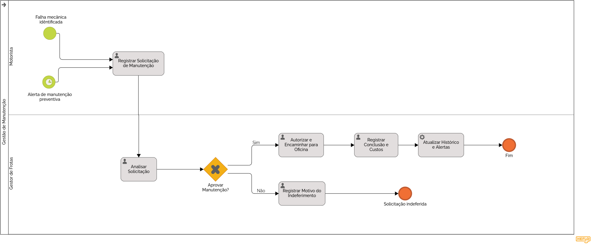

### 3.3.3 Processo 3 – Gestão de Manutenção

O processo de gestão de manutenção representa uma das principais lacunas nos controles manuais atualmente adotados pelas organizações. Na situação atual, o acompanhamento de manutenções preventivas e corretivas é frequentemente realizado de forma descentralizada, dependendo de planilhas isoladas, anotações informais ou da própria memória dos motoristas. Isso favorece a ocorrência de quebras inesperadas, o aumento significativo dos custos operacionais, riscos à segurança dos condutores e a ausência de rastreabilidade sobre o histórico de serviços e peças substituídas em cada veículo.

A principal oportunidade de melhoria consiste em digitalizar e automatizar o ciclo de acompanhamento e registro dos reparos da frota. O sistema monitorará a quilometragem e o tempo de uso de cada veículo, gerando alertas automáticos para as manutenções preventivas e eliminando a dependência de verificações manuais. No caso das manutenções corretivas, os relatos de falhas poderão ser registrados de forma padronizada. Cada ordem de serviço deverá ser avaliada e aprovada pelo gestor de frota antes da execução na oficina. Após a conclusão, os dados de custos e o tempo de inatividade alimentarão diretamente o módulo de histórico do veículo e os relatórios de despesas, garantindo rastreabilidade completa sem retrabalho.

O modelo BPMN do processo encontra-se representado a seguir:

#### Detalhamento das atividades

Registrar Solicitação de Manutenção. Atividade inicial onde o motorista relata o problema ou confirma a necessidade de preventiva.

**Registrar Solicitação de Manutenção**

| **Campo**              | **Tipo**         | **Restrições**                       | **Valor default** |
|------------------------|------------------|--------------------------------------|-------------------|
| Veículo                | Seleção única    | Obrigatório                          | -                 |
| Origem da Solicitação  | Seleção única    | Preventiva / Corretiva               | Corretiva         |
| Quilometragem Atual    | Número           | Obrigatório                          | -                 |
| Descrição do Problema  | Área de Texto    | Mínimo de 15 caracteres; obrigatório | -                 |
| Evidências (Fotos)     | Imagem           | Opcional                             | -                 |
| Data da Identificação  | Data             | Não pode ser futura                  | Data atual        |

| **Comandos**         |  **Destino**                   | **Tipo** |
|----------------------|--------------------------------|----------|
| Enviar solicitação   | Analisar Solicitação           | default  |
| Cancelar             | Início do Processo             | cancel   |

**Analisar Solicitação (Gestor de Frota)**

| **Campo**                | **Tipo**      | **Restrições**                    | **Valor default** |
|--------------------------|---------------|-----------------------------------|-------------------|
| Dados do Veículo / Falha | Tabela        | Somente leitura                   | -                 |
| Histórico de Manutenção  | Link          | Acesso ao prontuário do veículo   | -                 |
| Decisão de Aprovação     | Seleção única | Aprovado/Reprovado/Obrigatório    | -                 |                   
| Prioridade               | Seleção única | Baixa / Média / Alta              | Média             |

| **Comandos**         |  **Destino**                     | **Tipo**          |
|----------------------|----------------------------------|-------------------|
| Confirmar Análise    | Aprovar Manutenção? (Gateway)    | default           |

**Registrar Motivo do Indeferimento**

| **Campo**                 | **Tipo**         | **Restrições**     | **Valor default** |
|---------------------------|------------------|--------------------|-------------------|
| Justificativa da Reprova  | Área de Texto    | Obrigatório        | -                 |
| Data da Decisão           | Data e Hora      | Somente leitura    | Data e hora atual |

| **Comandos**    |  **Destino**                   | **Tipo** |
|-----------------|--------------------------------|----------|
| Finalizar       | Solicitação indeferida (Fim)   | default  |

**Autorizar e Encaminhar para Oficina**

| **Campo**              | **Tipo**         | **Restrições**  | **Valor default** |
|------------------------|------------------|-----------------|-------------------|
| Oficina Credenciada    | Seleção única    | Obrigatóro      | -                 |
| Prazo Previsto (Dias)  | Número           | Mínimo 1        | 2                 |
| Ordem de Serviço (PDF) | Arquivo          | Opcional        | -                 |

| **Comandos**         |  **Destino**                   | **Tipo** |
|----------------------|--------------------------------|----------|
| Iniciar Manutenção   | Registrar Conclusão e Custos   | default  |

**Registrar Conclusão e Custos**

| **Campo**                 | **Tipo**      | **Restrições**                       | **Valor default** |
|---------------------------|---------------|--------------------------------------|-------------------|
| Detalhamento de Serviços  | Tabela        | Descrição, Qtd e Valor Unitário      | -                 |
| Valor Total Final         | Número        | Somente leitura (Soma da tabela)     | -                 |
| Comprovante / NF          | Arquivo       | Obrigatório (PDF ou Imagem)          | -                 |
| Garantia do Serviço       | Seleção única | 3 meses / 6 meses / 12 meses         | -                 |

| **Comandos**                |  **Destino**                   | **Tipo** |
|-----------------------------|--------------------------------|----------|
| Finalizar Ordem de Serviço  | Atualizar Histórico e Alertas  | default  |

**Atualizar Histórico e Alertas (Tarefa de Serviço)**

| **Campo**               | **Tipo**       | **Restrições**                | **Valor default** |
|-------------------------|----------------|-------------------------------|-------------------|
| Status do Veículo       | Seleção única  | Somente leitura               | Disponível        |
| Próxima Revisão (KM)    | Número         | Calculado automaticamente     | -                 |
| Custo Total Acumulado   | Número         | Atualizado no banco de dados  | -                 |

| **Comandos**  |  **Destino**  | **Tipo** |
|---------------|---------------|----------|
| Concluir      | Fim           | default  |

