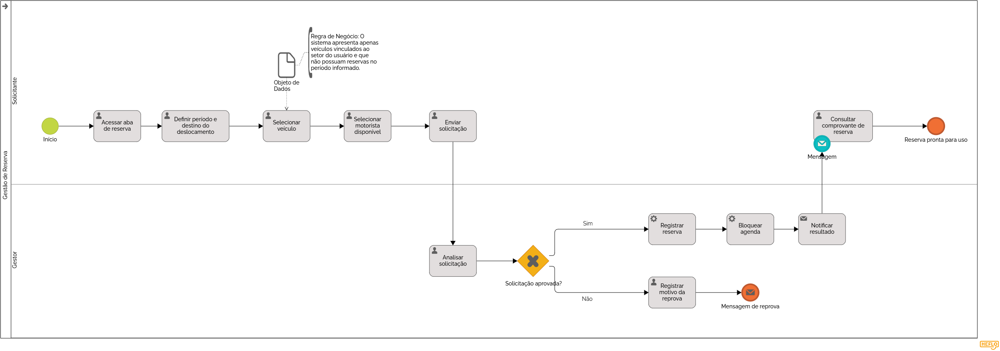

### 3.3.4 Processo 4 – Gestão de Reserva

O processo de reserva de veículos representa uma das principais lacunas nos sistemas manuais atualmente adotados pelos órgãos públicos. Na situação atual, solicitações de uso são realizadas de forma verbal ou por e-mail, sem padronização, sem registro formal e sem mecanismo de aprovação estruturado. Isso favorece conflitos de agenda, uso não autorizado de veículos e ausência de rastreabilidade sobre quem solicitou, quem aprovou e qual foi a finalidade do deslocamento.

A principal oportunidade de melhoria consiste em digitalizar e formalizar o fluxo de solicitação e aprovação de reservas. O sistema exibirá apenas veículos e motoristas disponíveis no período informado, eliminando a necessidade de uma etapa explícita de verificação de conflitos. Cada reserva deverá ser justificada e aprovada pelo gestor de frota antes de ser efetivada. Após a decisão, o solicitante será notificado automaticamente, e os dados da reserva aprovada alimentarão diretamente o módulo de registro de uso, garantindo rastreabilidade completa sem retrabalho.

O modelo BPMN do processo encontra-se representado a seguir:

---

#### Detalhamento das atividades

**Realizar Solicitação de Reserva**

| **Campo** | **Tipo** | **Restrições** | **Valor default** |
|---|---|---|---|
| Nome do solicitante | Caixa de Texto | Somente leitura | Usuário logado |
| Setor / Secretaria | Caixa de Texto | Somente leitura | Setor do usuário logado |
| Data de saída | Data | Igual ou posterior à data atual; obrigatório | — |
| Horário de saída | Hora | Obrigatório | — |
| Data de retorno previsto | Data | Igual ou posterior à data de saída; obrigatório | — |
| Horário de retorno previsto | Hora | Obrigatório | — |
| Destino | Caixa de Texto | Obrigatório | — |
| Finalidade / Justificativa | Área de Texto | Mínimo de 20 caracteres; obrigatório | — |
| Veículo | Seleção única | Exibe apenas veículos disponíveis no período informado; obrigatório | — |
| Motorista | Seleção única | Exibe apenas motoristas disponíveis no período informado; obrigatório | — |

| **Comandos** | **Destino** | **Tipo** |
|---|---|---|
| Enviar solicitação | Aprovação da Reserva | default |
| Cancelar | Início do Processo | cancel |

**Aprovar Reserva (Gestor de Frota)**

A solicitação é encaminhada ao gestor de frota, que analisa as informações e decide pela aprovação ou reprovação.

| **Campo** | **Tipo** | **Restrições** | **Valor default** |
|---|---|---|---|
| Dados da solicitação | Tabela | Somente leitura | — |
| Decisão | Seleção única | Aprovado / Reprovado; obrigatório | — |
| Parecer | Área de Texto | Obrigatório em caso de reprovação | — |
| Data e hora da decisão | Data e Hora | Preenchida automaticamente | Data e hora atuais |

| **Comandos** | **Destino** | **Tipo** |
|---|---|---|
| Confirmar decisão | Notificação ao Solicitante | default |

**Notificar Solicitante**

O sistema envia automaticamente uma notificação ao solicitante com o resultado da análise do gestor.

| **Campo** | **Tipo** | **Restrições** | **Valor default** |
|---|---|---|---|
| Status da reserva | Caixa de Texto | Aprovada / Reprovada; somente leitura | — |
| Parecer do gestor | Área de Texto | Somente leitura | — |
| Dados confirmados da reserva | Tabela | Exibido apenas em caso de aprovação; somente leitura | — |

| **Comandos** | **Destino** | **Tipo** |
|---|---|---|
| Visualizar reserva | Consulta de Reservas | default |
| Voltar ao início | Início do Processo | cancel |

**Registrar Reserva**

Executado automaticamente pelo sistema após a aprovação. Bloqueia o veículo e o motorista no período e cria o rascunho de registro de uso correspondente.

| **Campo** | **Tipo** | **Restrições** | **Valor default** |
|---|---|---|---|
| Código da reserva | Caixa de Texto | Gerado automaticamente; somente leitura | — |
| Status | Seleção única | Confirmada / Em andamento / Concluída / Cancelada | Confirmada |
| Vínculo com registro de uso | Link | Gerado automaticamente | — |

| **Comandos** | **Destino** | **Tipo** |
|---|---|---|
| Concluir | Fim do Processo | default |
