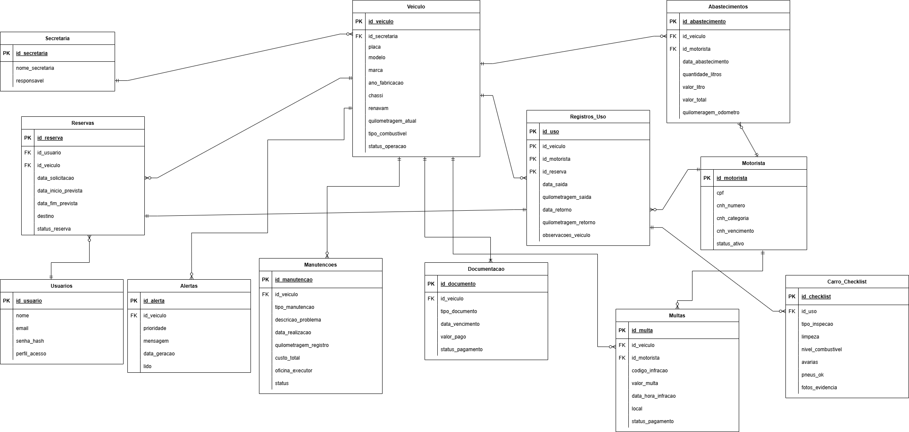

## 4. Projeto da solução

### 4.1. Modelo de dados

---

### 4.2. Tecnologias

| **Dimensão**   | **Tecnologia**  |
| ---            | ---             |
| SGBD           | MySQL           |
| Front end      | React+Tailwind+JavaScript   |
| Back end       | Java SpringBoot |
| Deploy         | Render    |

